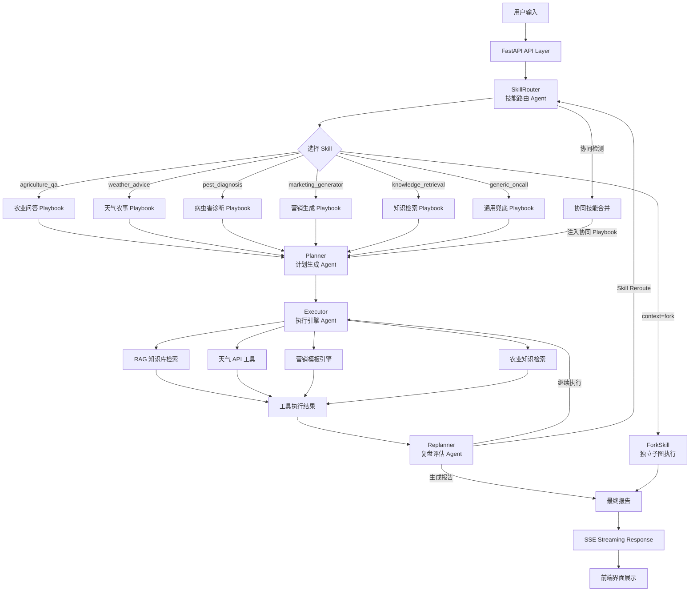

# AgroAgentOS 智农协同平台

面向农业领域的多智能体协同平台，提供农业知识问答、天气农事建议、病虫害诊断、农产品营销内容生成等功能。

项目基于 `FastAPI`、`LangGraph`、`RAG`、`Milvus`、`MCP` 和 DeepSeek / DashScope 兼容大模型构建。系统采用 **农业技能路由 + 智能体协同** 的架构，可根据用户问题自动选择合适的农业专家技能，调用天气、知识库等工具，输出专业的农业建议。


---

## 核心功能

### 1. 农业智能问答
- 支持各类农作物种植技术咨询
- 提供施肥、灌溉、田间管理建议
- 结合知识库和天气信息给出综合建议

### 2. 天气农事顾问
- 实时天气查询（支持多城市）
- 根据天气条件给出农事作业建议
- 喷药、播种、灌溉、采收时机判断

### 3. 病虫害诊断专家
- 识别农作物病虫害症状
- 提供科学的防治方案
- 推荐合适的农药和使用方法

### 4. 农产品营销助手
- 生成抖音/小红书/直播等平台营销内容
- 支持多种风格（专业/幽默/情感/故事）
- 模板化输出，即用即取

### 5. 农业知识库
- 上传农业文档，自动建立向量索引
- RAG 检索增强，减少大模型幻觉
- 支持混合检索（向量 + 关键词）

---

## 技术架构

```
┌──────────────────────────────────────────────────────────────────────┐
│                        AgroAgentOS 智农协同平台                       │
├──────────────────────────────────────────────────────────────────────┤
│                          Multi-Agent 协同层                           │
│  ┌────────────┐  ┌──────────┐  ┌──────────┐  ┌──────────┐           │
│  │SkillRouter │─▶│ Planner  │─▶│ Executor │─▶│Replanner │──┐        │
│  │ (技能路由)  │  │ (计划生成) │  │ (执行引擎) │  │ (复盘评估) │  │        │
│  └────────────┘  └──────────┘  └──────────┘  └──────────┘  │        │
│        │                                          │        │        │
│        ▼                                          └────────┘        │
│  ┌────────────┐                                  (loop/replan)      │
│  │ ForkSkill  │  (独立子图执行)                                      │
│  └────────────┘                                                     │
├──────────────────────────────────────────────────────────────────────┤
│                            Skill 技能层                               │
│  ┌──────────────┐ ┌──────────────┐ ┌──────────────┐ ┌────────────┐  │
│  │agriculture_qa│ │weather_advice│ │pest_diagnosis│ │ marketing  │  │
│  │  (农业问答)   │ │ (天气农事)   │ │ (病虫害诊断)  │ │_generator  │  │
│  └──────────────┘ └──────────────┘ └──────────────┘ │(营销生成)  │  │
│  ┌──────────────┐ ┌──────────────┐                   └────────────┘  │
│  │knowledge_    │ │generic_oncall│                                   │
│  │retrieval     │ │ (通用兜底)   │                                   │
│  │(知识检索)     │ └──────────────┘                                   │
│  └──────────────┘                                                    │
├──────────────────────────────────────────────────────────────────────┤
│                            工具与服务层                               │
│  ┌──────────┐  ┌──────────┐  ┌──────────┐  ┌──────────┐            │
│  │ 天气API  │  │农业知识库 │  │ LLM 推理  │  │营销模板   │            │
│  │ (MCP)    │  │(RAG+Milvus)│ │(DashScope)│  │引擎      │            │
│  └──────────┘  └──────────┘  └──────────┘  └──────────┘            │
└──────────────────────────────────────────────────────────────────────┘
```

---

## 快速开始

### 1. 环境准备

```bash
# 克隆项目
git clone https://github.com/YOUR_USERNAME/AgroAgentOS.git
cd AgroAgentOS

# 创建虚拟环境
python -m venv .venv
source .venv/bin/activate  # Windows: .venv\Scripts\activate

# 安装依赖
pip install -r requirements.txt
```

### 2. 配置环境变量

```bash
# 复制配置文件
cp .env.example .env

# 编辑 .env，填入你的 DashScope API Key
# DASHSCOPE_API_KEY=your-api-key
```

### 3. 启动服务

```bash
# 启动 Milvus 向量数据库
docker-compose up -d milvus

# 启动应用
python -m app.main
```

### 4. 访问应用

- 前端界面：http://localhost:9800
- API 文档：http://localhost:9800/docs

---

## 农业技能列表

| 技能名称 | 功能描述 | 触发关键词 | 工具白名单 |
|---------|---------|-----------|-----------|
| agriculture_qa | 农业智能问答 | 种植、栽培、施肥、灌溉、播种 | `search_knowledge_base`, `search_agriculture_kb` |
| weather_advice | 气象农事顾问 | 天气、温度、降雨、风速、明天、今天 | `get_weather`, `search_knowledge_base` |
| pest_diagnosis | 病虫害诊断 | 病虫害、打药、农药、生虫、发黄、枯萎 | `search_knowledge_base`, `search_agriculture_kb` |
| marketing_generator | 农产品营销 | 营销、广告、文案、销售、直播、带货 | `generate_marketing_content` |
| knowledge_retrieval | 知识库检索 | 知识库、查资料、检索、文档 | `search_knowledge_base`, `search_agriculture_kb` |
| generic_oncall | 通用农业助手 | 兜底技能（其他技能不匹配时） | 通用只读工具 |

### 协同技能组合

| 组合 | 触发示例 | 说明 |
|------|---------|------|
| weather + pest | "明天适合打药吗" | 天气条件 + 病虫害防治建议 |
| weather + agriculture | "明天适合播种吗" | 天气条件 + 种植技术建议 |
| pest + agriculture | "叶子发黄是不是肥施多了" | 病虫害诊断 + 种植管理建议 |
| weather + pest + agriculture | "下雨前能打药施肥吗" | 三技能协同，综合建议 |

---

## 数据库配置

### Milvus 向量数据库
- Collection 名称：`agro_agent_kb`
- 用于存储农业知识库的向量索引

### SQLite 数据库
- 数据库文件：`data/agro_agent.db`
- 存储会话记录、天气查询、营销任务、病虫害诊断等数据
- `run.ps1` 一键启动时优先走 Docker Compose 拉起 open-webSearch；Docker 不可用时回退到本地 `npm run serve`。
- `run.ps1 -Stop` 同时停止 Compose 服务和监听端口，避免误杀 Docker 端口代理进程。


## 核心设计

传统的农业问答系统如果直接把完整知识库、完整工具列表和用户问题一起交给 LLM，容易出现 prompt 过长、工具选择噪声大、回答质量不可控等问题。

本项目采用 **Skill-first** 的多智能体流程：

```text
用户农业问题（如"玉米叶子发黄怎么办"）
        |
        v
Skill Router (技能路由)
先判断问题类型，选择最匹配的农业 Skill
        |
        v
Skill Playbook (技能剧本)
加载该问题类型对应的知识库、工具白名单和回答策略
        |
        v
Planner (计划生成)
基于选中的 Skill 生成 4-6 步执行计划
        |
        v
Executor (执行引擎)
只调用该 Skill 允许的工具（RAG 检索、天气 API 等）
        |
        v
Replanner (复盘评估)
根据工具结果判断继续执行、调整计划或收敛
        |
        v
Report (最终报告)
生成结构化 Markdown 农业建议报告
```

核心思路是：

> **先选 Skill，再规划；先收敛上下文，再调用工具。**

这样可以减少无关 prompt，降低工具误选概率，并让回答链路更稳定、更容易观测。

## 功能特性

- **Skill-first 多智能体协同**：先通过 `SkillRouter` 识别农业问答、天气农事、病虫害诊断、营销生成等问题类型，再加载对应 Skill Playbook。
- **Plan-Execute-Replan 流程**：基于 `Planner -> Executor -> Replanner -> Report` 的诊断闭环，支持动态调整执行步骤。
- **多 Agent 协同**：当用户问题涉及多个领域时（如"明天适合打药吗"），自动触发天气+病虫害协同，合并多个 Skill 的 Playbook 和工具集。
- **Skill 工具白名单**：每个 Skill 只暴露相关工具，减少无关工具进入上下文，降低误调用风险。
- **RAG 知识库**：使用 DashScope Embedding + Milvus，支持农业知识库检索，包含种植技术、病虫害防治、土壤管理、气象知识等 11 个专业文档。
- **知识引用展示**：前端展示知识来源、分类标签和相关度评分，增强回答可信度。
- **实时天气工具**：接入天气 API，支持多城市天气查询和农事作业建议。
- **并行工具调用**：对互不依赖的只读工具进行并发执行，缩短多工具等待时间。
- **真实 Token 监控**：支持 DashScope 流式 usage 回传，前端展示 input / output / total tokens。
- **SSE 流式输出**：前端实时展示 Skill 选择、执行计划、工具调用、token、耗时和最终报告。
- **Skill Reroute**：当 Replanner 发现当前 Skill 方向不对时，可切换到另一个 Skill 重新规划。
- **Fork 模式**：支持将长任务 Skill 作为独立子图执行，实现上下文隔离。

## 架构概览



## Agent 详细说明

### 核心 Agent 节点

| Agent | 文件 | 职责 |
|-------|------|------|
| **SkillRouter** | `app/agents/skill_router.py` | 技能路由 Agent。分析用户输入，选择最匹配的农业 Skill。支持协同技能检测（如"明天适合打药吗"触发天气+病虫害协同）。 |
| **Planner** | `app/agents/planner.py` | 计划生成 Agent。基于选定 Skill 的 Playbook，将用户问题拆解为 4-6 步可执行计划。支持多技能 Playbook 合并。 |
| **Executor** | `app/agents/executor.py` | 执行引擎 Agent。执行计划中的每一步，调用工具（RAG 检索、天气 API 等）收集信息。支持并行工具调用和协同工具合并。 |
| **Replanner** | `app/agents/replanner.py` | 复盘评估 Agent。评估已收集的证据，决定继续执行、调整计划、切换 Skill（Reroute）或生成最终报告。 |
| **ForkSkill** | `app/agents/fork_runner.py` | 独立子图执行器。将标记为 `context: fork` 的 Skill 作为独立子任务运行，实现上下文隔离。 |

### Agent 协作流程

```text
┌─────────────────────────────────────────────────────────────────┐
│                     Plan-Execute-Replan 循环                     │
├─────────────────────────────────────────────────────────────────┤
│                                                                 │
│   SkillRouter ──▶ Planner ──▶ Executor ──▶ Replanner            │
│        │                           ▲           │                │
│        │                           └───────────┘                │
│        │                            (继续执行)                   │
│        │                                                       │
│        │                           ┌───────────┐                │
│        └───────────────────────────┤  (Reroute) │                │
│           (切换 Skill 重新规划)     └───────────┘                │
│                                                                 │
│   协同模式:                                                      │
│   SkillRouter 检测到协同意图 ──▶ 合并多个 Skill 的 Playbook       │
│                              ──▶ 合并多个 Skill 的工具集          │
│                              ──▶ Planner 生成跨领域计划           │
└─────────────────────────────────────────────────────────────────┘
```

### Agent 系统提示词

系统为不同角色的 Agent 提供专业化人设提示词（`app/prompts/agriculture_system.py`）：

| 角色 | 提示词 | 专业领域 |
|------|--------|---------|
| 农业专家 | `AGRICULTURE_EXPERT_SYSTEM` | 种植技术、土壤改良、灌溉、气象灾害防御 |
| 气象顾问 | `WEATHER_ADVISOR_SYSTEM` | 天气解读、农事作业建议、气象灾害预警 |
| 病虫害专家 | `PEST_DIAGNOSIS_SYSTEM` | 病虫害识别、防治方案、农药使用指导 |
| 营销文案师 | `MARKETING_EXPERT_SYSTEM` | 短视频脚本、小红书文案、直播口播稿 |
| 知识检索员 | `KNOWLEDGE_RETRIEVER_SYSTEM` | 知识库检索、信息整理、来源引用 |

### 多 Agent 协同（Phase 3）

当用户问题涉及多个领域时，系统自动触发多 Agent 协同：

```text
示例: "明天适合打药吗"
  ↓
SkillRouter 检测到 weather + pest 协同
  ↓
Planner 合并天气 Playbook + 病虫害 Playbook
  ↓
Executor 合并天气工具 + 病虫害工具
  ↓
生成综合建议（天气条件 + 打药时机 + 药剂选择）
```

协同模式支持：
- **双技能协同**: 天气+病虫害、天气+种植、病虫害+种植
- **三技能协同**: 天气+病虫害+种植

## 数据流

```text
1. 输入阶段
   用户输入农业问题（如"玉米叶子发黄怎么办"）。

2. Skill 选择阶段
   SkillRouter 分析语义，选择最匹配的 Skill（如 pest_diagnosis）。
   同时检测是否需要协同技能（如涉及天气+病虫害）。

3. 计划生成阶段
   Planner 基于选定 Skill 的 Playbook 生成 4-6 步执行计划。
   如有协同技能，合并多个 Playbook 生成跨领域计划。

4. 工具执行阶段
   Executor 调用 RAG 检索、天气 API 等工具收集信息。
   如有协同技能，合并多个 Skill 的工具集。

5. 复盘阶段
   Replanner 评估证据是否足够：
   - 不够 → 继续执行
   - 需要切换方向 → Reroute 到另一个 Skill
   - 足够 → 生成最终报告

6. 报告阶段
   生成结构化 Markdown 报告，前端通过 SSE 实时展示全过程。
```

## 性能与评估数据

项目内置 benchmark 和 RAG 离线评估脚本，对 token、工具执行和检索准确率进行了量化评估。

### 通用性能指标

| 指标 | 优化结果 |
|---|---:|
| Planner prompt tokens | `9098 -> 575`，下降 **93.5%** |
| 全链路 prompt tokens | `10526 -> 2450`，下降 **76.7%** |
| 全链路 total tokens | `11889 -> 3988`，下降 **66.5%** |
| 工具 catalog prompt tokens | 下降 **55.3%** |
| 只读工具并行执行 | `1.06s -> 0.22s`，加速 **4.88x**，延迟下降 **79.5%** |

### 农业知识库指标

| 指标 | 数值 |
|---|---:|
| 农业知识文档 | **11** 个专业文档 |
| 知识分类 | **4** 大分类（种植/植保/土肥/气象） |
| 预估 chunks | **164** 个知识片段 |
| 检索方式 | 混合检索（BM25 + 向量 + RRF + Reranker） |
| 支持分类过滤 | 是（按种植/植保/土肥/气象分类） |

说明：

- Token 数据来自真实 DashScope `usage` 返回。
- 并行工具数据是 5 个独立只读工具的受控基准测试。
- 农业知识库覆盖水稻、小麦、玉米、蔬菜等主要作物的种植和病虫害防治知识。

## 农业知识库

项目内置 11 个农业专业知识文档，覆盖 4 大分类：

| 分类 | 文档 | 主要内容 |
|------|------|---------|
| 种植技术 | 水稻种植指南、小麦种植技术、玉米高产栽培、蔬菜大棚种植 | 播种、育苗、施肥、灌溉、收获等全流程技术 |
| 病虫害防治 | 水稻病虫害防治、小麦病虫害防治、玉米病虫害防治、蔬菜病虫害防治 | 病害识别、虫害防治、农药使用、绿色防控 |
| 土壤管理 | 土壤改良与肥料管理 | 土壤检测、改良方法、肥料配方、水肥一体化 |
| 气象知识 | 农业气象灾害防御、天气与农事安排 | 灾害预警、防灾措施、农事时令安排 |

### 知识库导入

```powershell
# 检查切分结果（干运行）
python scripts\ingest_agriculture_kb.py --dry-run

# 导入知识库（重置模式）
python scripts\ingest_agriculture_kb.py --reset

# 按分类导入
python scripts\ingest_agriculture_kb.py --category planting
```

### 知识库检索特性

- **分类过滤**：支持按种植技术、病虫害防治、土壤管理、气象知识分类检索
- **混合检索**：BM25（稀疏）+ 向量（稠密）+ RRF 融合 + Reranker 重排序
- **知识引用**：返回来源、章节、分类标签和相关度评分
- **自动分类**：根据用户问题自动检测相关分类，优先检索该分类下的知识

## 数据来源

项目包含以下知识库语料：

| 路径 | 说明 |
|---|---|
| `knowledge_base/` | 农业专业知识文档（11 个 .md 文件，4 大分类） |
| `docs/sop/` | 项目内置 Redis / MySQL / 通用告警 SOP |
| `data/kb_corpus/awesome-prometheus-alerts/` | 从开源项目 `samber/awesome-prometheus-alerts` 整理的 Prometheus 告警语料 |

第三方语料 / 参考来源的作者、仓库地址和许可详见文末 [License](#license) 一节。

## 技术栈

| 类型 | 技术 |
|---|---|
| Web 服务 | FastAPI + Uvicorn |
| Agent 编排 | LangGraph + LangChain |
| LLM | DashScope / Qwen（qwen-max / qwen-turbo） |
| Embedding | DashScope `text-embedding-v4` (1024 dim) |
| Reranker | DashScope `gte-rerank-v2` |
| 向量数据库 | Milvus（HNSW + COSINE 索引） |
| 会话记忆 | Redis，可选 |
| 工具协议 | MCP / FastMCP |
| 天气 API | 心知天气 / 和风天气 |
| 前端 | HTML + TailwindCSS + Vanilla JS |
| 运行环境 | Python 3.11+ / Docker / Windows PowerShell |

## 快速开始

### 1. 克隆项目

```powershell
git clone <your-repo-url>
cd multi_agent_github
```

### 2. 创建 Python 环境

```powershell
python -m venv .venv
.\.venv\Scripts\Activate.ps1
pip install -r requirements.txt
```

### 3. 配置环境变量

```powershell
copy .env.example .env
notepad .env
```

至少需要配置：

```env
DASHSCOPE_API_KEY=your-dashscope-api-key
KB_ADMIN_TOKEN=change-this-admin-token
```

默认联网搜索使用 `mock` 模式，不需要外部搜索 API。

如需 Tavily 搜索：

```env
WEB_SEARCH_PROVIDER=tavily
TAVILY_API_KEY=your-tavily-api-key
```

### 4. 启动 Milvus 和 Redis

```powershell
docker compose up -d
```

Milvus 用于向量检索，Redis 用于可选的 RAG Chat 会话记忆。

### 5. 导入知识库

#### 导入农业知识库

```powershell
# 检查切分结果（干运行）
python scripts\ingest_agriculture_kb.py --dry-run

# 导入农业知识库（重置模式）
python scripts\ingest_agriculture_kb.py --reset

# 按分类导入
python scripts\ingest_agriculture_kb.py --category planting
python scripts\ingest_agriculture_kb.py --category pest_control
python scripts\ingest_agriculture_kb.py --category soil
python scripts\ingest_agriculture_kb.py --category weather
```

#### 导入通用知识库（可选）

```powershell
python scripts\ingest_kb_corpus.py --dry-run
python scripts\ingest_kb_corpus.py --reset
```

### 6. 启动应用

```powershell
powershell -NoProfile -ExecutionPolicy Bypass -File .\run.ps1
```

默认会启动：

```text
FastAPI       http://localhost:9800
天气 MCP      http://localhost:8005/mcp
农业知识 MCP   http://localhost:8008/mcp
```

停止服务：

```powershell
powershell -NoProfile -ExecutionPolicy Bypass -File .\run.ps1 -Stop
```

## 访问地址

| 页面 | 地址 |
|---|---|
| Web UI | http://localhost:9800 |
| Swagger | http://localhost:9800/docs |
| ReDoc | http://localhost:9800/redoc |
| 健康检查 | http://localhost:9800/api/v1/health |
| 就绪检查 | http://localhost:9800/api/v1/health/ready |
| Attu Milvus UI | http://localhost:8000 |

## 使用示例

### 农业种植咨询

```text
玉米什么时候播种最好？
```

系统会选择 `agriculture_qa` Skill，从知识库检索玉米种植技术，给出播种时间、温度、土壤条件等建议。

### 病虫害诊断

```text
我的番茄叶子发黄，还有白色粉末，是什么病？
```

系统会选择 `pest_diagnosis` Skill，从知识库检索番茄病虫害防治知识，诊断可能是白粉病，给出防治方案和用药建议。

### 天气农事建议（协同模式）

```text
明天适合打药吗？
```

系统会触发 `weather_advice` + `pest_diagnosis` 协同：
1. 查询明天天气（温度、降雨概率、风速）
2. 结合病虫害防治知识
3. 给出综合建议（是否适合打药、最佳时间窗口）

### 农产品营销生成

```text
帮我写一段苹果的抖音推广文案
```

系统会选择 `marketing_generator` Skill，生成适合抖音平台的 15-60 秒脚本，包含 hook + 卖点 + CTA。

### 知识库检索

```text
查一下葡萄种植技术
```

系统会选择 `knowledge_retrieval` Skill，从农业知识库检索相关内容，展示来源、章节和相关度评分。

## API 概览

| 功能 | 方法 | 路径 | 说明 |
|---|---|---|---|
| 农业智能诊断 | POST | `/api/v1/aiops/diagnose` | Multi-Agent 协同诊断，SSE 流式输出 |
| RAG Chat | POST | `/api/v1/chat/stream` | 农业知识问答，支持知识引用 |
| Skill 列表 | GET | `/api/v1/skills` | 查看所有农业技能 |
| 上传文档 | POST | `/api/v1/documents/upload` | 上传知识库文档 |
| 文档列表 | GET | `/api/v1/documents` | 查看知识库文档 |
| 删除文档 | DELETE | `/api/v1/documents/{source}` | 删除知识库文档 |
| 健康检查 | GET | `/api/v1/health` | 服务健康状态 |
| 就绪检查 | GET | `/api/v1/health/ready` | 服务就绪状态 |

知识库上传和删除需要请求头：

```http
X-KB-Admin-Token: your-admin-token
```

## 项目结构

```text
AgroAgentOS/
├── app/                          # FastAPI / Agent / RAG / Skill 核心代码
│   ├── agents/                   # Multi-Agent 核心
│   │   ├── graph.py              # LangGraph 图编排
│   │   ├── skill_router.py       # 技能路由 Agent
│   │   ├── planner.py            # 计划生成 Agent
│   │   ├── executor.py           # 执行引擎 Agent
│   │   ├── replanner.py          # 复盘评估 Agent
│   │   ├── fork_runner.py        # 独立子图执行器
│   │   └── state.py              # 状态定义
│   ├── skills/                   # Skill 技能系统
│   │   ├── definitions/          # 6 个农业 Skill 定义
│   │   │   ├── agriculture_qa/   # 农业问答
│   │   │   ├── weather_advice/   # 天气农事
│   │   │   ├── pest_diagnosis/   # 病虫害诊断
│   │   │   ├── marketing_generator/ # 营销生成
│   │   │   ├── knowledge_retrieval/ # 知识检索
│   │   │   └── generic_oncall/   # 通用兜底
│   │   ├── models.py             # Skill 数据模型
│   │   ├── loader.py             # SKILL.md 解析器
│   │   └── registry.py           # SkillRegistry 单例
│   ├── prompts/                  # 系统提示词
│   │   └── agriculture_system.py # 5 个角色的专家人设
│   ├── services/                 # 业务服务
│   │   └── rag/                  # RAG 检索服务
│   │       ├── retrieval.py      # 通用检索
│   │       └── agriculture_retrieval.py # 农业专用检索
│   ├── core/                     # 核心组件
│   │   ├── llm.py                # LLM 封装
│   │   ├── vector_store.py       # Milvus 向量存储
│   │   └── agriculture_retriever.py # 农业检索器
│   └── runtime/                  # 运行时组件
│       ├── agent_harness.py      # Agent 执行框架
│       ├── tool_filter.py        # 工具白名单过滤
│       └── transitions.py        # 状态转换记录
├── knowledge_base/               # 农业知识库文档（11 个 .md）
│   ├── planting/                 # 种植技术（4 个文档）
│   ├── pest_control/             # 病虫害防治（4 个文档）
│   ├── soil/                     # 土壤管理（1 个文档）
│   └── weather/                  # 气象知识（2 个文档）
├── scripts/                      # 脚本工具
│   ├── ingest_agriculture_kb.py  # 农业知识库导入脚本
│   ├── ingest_kb_corpus.py       # 通用知识库导入脚本
│   └── mock_alert.py             # 告警模拟脚本
├── mcp_servers/                  # MCP 工具服务
├── frontend/                     # 前端页面
├── docs/sop/                     # 内置 SOP 文档
├── data/kb_corpus/               # RAG 开源语料
├── docker-compose.yml            # Milvus + etcd + MinIO + Attu + Redis
├── requirements.txt
├── .env.example
├── .gitignore
└── run.ps1                       # Windows 一键启动脚本
```

## License

本项目代码以 **MIT License** 发布。

项目集成或参考了以下第三方开源资产，公开发布时请遵守各自的许可与署名要求：

- **[Aas-ee/open-webSearch](https://github.com/Aas-ee/open-webSearch)** — 作者 [@Aas-ee](https://github.com/Aas-ee)。V2 本地联网搜索 daemon，Docker 镜像 `ghcr.io/aas-ee/open-web-search:latest`，本仓库副本位于 `open-webSearch-main/`，由 `app/core/web_search.py` 通过 HTTP 调用。
- **[samber/awesome-prometheus-alerts](https://github.com/samber/awesome-prometheus-alerts)** — 作者 [@samber](https://github.com/samber)。RAG 知识库中 Prometheus 告警语料的来源，原始内容遵循 Creative Commons Attribution 4.0 International (CC BY 4.0)。本仓库副本位于 `data/kb_corpus/awesome-prometheus-alerts/`。
- **小林 OnCall Agent 项目** — 参考其 OnCall Agent 场景设计、诊断流程和项目表达方式。
