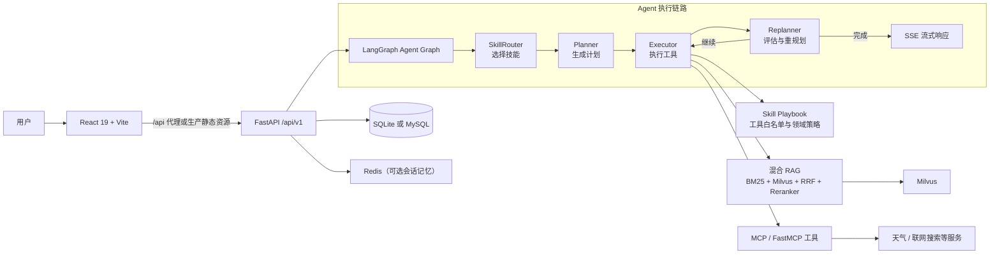

# AgroAgentOS

面向农业场景的多智能体协同平台。AgroAgentOS 将农业知识库、天气与联网检索工具、领域技能（Skill）和大语言模型组合起来，为种植管理、病虫害防治、农事安排与农产品营销提供可追溯的智能辅助。

> 本项目用于提供信息与决策辅助，不能替代当地农技人员的现场诊断、农药标签要求或行政监管规定。


## 能做什么

- 农业知识问答：结合本地知识库给出种植、土肥与田间管理建议。
- 天气农事建议：基于天气条件辅助安排播种、灌溉、施肥和植保作业。
- 病虫害诊断：围绕症状、作物和生育期检索防治知识，生成结构化建议。
- 农产品营销：生成适用于短视频、图文和直播等场景的营销内容。
- 市场与农场管理：提供市场信息、农场地块和会话等业务能力。
- 知识库管理：支持文档上传、检索和农业语料导入。

## 架构概览



一次请求会先由 `SkillRouter` 选择适合的农业技能，然后依次进入 `Planner → Executor → Replanner`。执行器仅获得当前 Skill 允许调用的工具；复盘节点决定继续执行、切换技能重新规划，或输出最终报告。前端通过 SSE 实时展示执行进度与结果。

## 快速开始

### 前置条件

- Python 3.11+
- Node.js 20+ 与 npm
- Docker Desktop（推荐，用于 Milvus、Redis、MySQL 和 open-webSearch）
- DashScope API Key（运行 LLM、Embedding 与 Reranker 所需）

### 1. 安装依赖

```powershell
git clone https://github.com/SirWangCNU/AgroAgentOS.git
cd AgroAgentOS

python -m venv .venv
.\.venv\Scripts\Activate.ps1
pip install -r requirements.txt

Set-Location frontend-react
npm ci
Set-Location ..
```

### 2. 配置环境变量

```powershell
Copy-Item .env.example .env
```

编辑 `.env`，至少填写：

```env
DASHSCOPE_API_KEY=your-dashscope-api-key
KB_ADMIN_TOKEN=replace-with-a-strong-admin-token
JWT_SECRET_KEY=replace-with-a-random-secret-at-least-32-chars
```

默认使用 SQLite（`USE_SQLITE=true`）。如需 MySQL，将其改为 `false` 并补全 `MYSQL_*` 配置。天气 API 与视频生成 API 均为可选配置；未配置天气密钥时，相关能力会使用 Mock 数据。

### 3. 启动基础设施

```powershell
docker compose up -d
```

该命令启动 Milvus、Redis、MySQL、Attu、MinIO 和 open-webSearch。只想启动应用也可以使用下面的一键脚本，它会按需拉起 Milvus、Redis 和本地服务。

### 4. 启动应用

推荐 Windows 一键启动：

```powershell
.\run.ps1
```

常用参数：

```powershell
.\run.ps1 -NoMilvus -NoRedis       # 不自动启动基础设施
.\run.ps1 -NoFrontend              # 只启动后端
.\run.ps1 -Logs                    # 查看应用日志
.\run.ps1 -Stop                    # 停止本项目服务
```

也可以分别启动开发服务：

```powershell
# 终端 1：后端
uvicorn app.main:app --reload --port 9800

# 终端 2：前端
Set-Location frontend-react
npm run dev
```

### 5. 访问服务

| 服务 | 地址 |
| --- | --- |
| 前端开发服务器 | http://localhost:3000 |
| 后端 Web UI（已构建前端时） | http://localhost:9800 |
| Swagger API 文档 | http://localhost:9800/docs |
| ReDoc | http://localhost:9800/redoc |
| 健康检查 | http://localhost:9800/api/v1/health |
| Milvus 管理界面 Attu | http://localhost:8000 |
| MinIO 控制台 | http://localhost:9001 |

生产环境下，先在 `frontend-react/` 执行 `npm run build`；FastAPI 会优先挂载 `frontend-react/dist/`，并为 SPA 路由返回前端入口。

## 使用示例

可以直接在 Web UI 中发起如下问题：

```text
玉米叶片发黄并有斑点，应该先检查什么？
```

```text
北京明天适合给番茄喷药吗？
```

```text
为当季苹果写一段 30 秒的短视频推广文案。
```

系统会选择对应的 Skill，并将知识检索、天气或其他工具结果整合为回答。涉及多个领域的问题可在同一轮中协调多个 Skill。

## 导入农业知识库

内置农业资料位于 `knowledge_base/`。首次使用或更新语料后，可运行：

```powershell
# 查看文档切分结果，不写入数据库
python scripts\ingest_agriculture_kb.py --dry-run

# 重建全部农业知识库索引
python scripts\ingest_agriculture_kb.py --reset

# 仅导入指定分类
python scripts\ingest_agriculture_kb.py --category planting
python scripts\ingest_agriculture_kb.py --category pest_control
python scripts\ingest_agriculture_kb.py --category soil
python scripts\ingest_agriculture_kb.py --category weather
```

RAG 检索使用 BM25 与 Milvus 向量检索召回候选内容，使用 RRF 融合，并可通过 DashScope `gte-rerank-v2` 重排序；相关开关可在 `.env` 中调整。

## 项目结构

```text
AgroAgentOS/
├── app/
│   ├── api/v1/              # FastAPI 路由（统一挂载在 /api/v1）
│   ├── agents/              # LangGraph：路由、规划、执行与复盘
│   ├── core/                # 数据库、LLM、Milvus、Redis、MCP 等适配器
│   ├── models/              # 领域模型
│   ├── runtime/             # 工具运行与执行时能力
│   ├── schemas/             # 请求与响应模型
│   ├── services/            # 业务服务层
│   ├── skills/definitions/  # YAML frontmatter + Markdown Skill Playbook
│   └── tools/               # 工具实现
├── frontend-react/          # React 19 + Vite + Tailwind CSS 前端
├── mcp_servers/             # MCP 工具服务
├── knowledge_base/          # 农业知识库源文档
├── scripts/                 # 知识库导入与运维脚本
├── tests/services/          # 后端主要测试
├── docker-compose.yml       # 本地基础设施
└── run.ps1                  # Windows 一键启动/停止脚本
```

## 常用开发命令

```powershell
# 后端测试
pytest

# 数据库迁移
alembic upgrade head
alembic revision --autogenerate -m "description"

# 前端检查与构建
Set-Location frontend-react
npm run lint
npm run build
```

## 配置与安全提示

- 不要提交 `.env`、真实 API Key、管理员 Token 或数据库密码。
- `.env.example` 中的 `ADMIN_DEFAULT_PASSWORD` 和密钥仅用于本地示例，部署前必须替换。
- 文档上传和删除接口需要携带 `X-KB-Admin-Token`。
- Milvus 是启动时的必需依赖；Redis 连接失败不会阻止服务启动，但会影响可选的会话记忆能力。

## 相关文档

- [技能系统说明](app/skills/README.md)
- [项目文档索引](docs/README.md)
- [前端说明](frontend-react/README.md)

## 贡献

欢迎提交 Issue 和 Pull Request。提交前请确保后端测试通过，并在修改前端代码后运行 `npm run lint` 与 `npm run build`。
