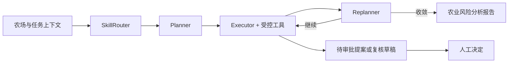

# AgroAgentOS AI 农场决策与执行平台

AgroAgentOS 是一个面向人工智能比赛演示的农业多智能体平台。核心体验不是单轮问答，而是把农场数据、天气、轨迹质量和农业知识组织成可审计的行动闭环：

```text
AI 综合巡检 → 有证据的风险 → 待审批行动提案
→ 人工批准 → 农事任务 → AI 复核草稿 → 人工验收
```

后端使用 FastAPI、LangGraph、SQLAlchemy、RAG/Milvus 和 MCP；前端使用 React 19、Vite、TanStack Query 与 Zustand。

## 比赛亮点

- 可见的智能体执行：Skill、计划、工具调用、步骤、复盘和报告通过 SSE 实时展示。
- 证据优先：风险区分实测事实、规则判断和模型推断，并明确展示数据缺口。
- 两道人类决策门：AI 不能自行批准提案，也不能自行完成任务。
- 真实业务落地：提案、任务、执行证据、复核草稿和 AgentRun 全部持久化。
- 安全权限：身份由 `FarmRunContext` 注入，工具不信任模型传入的用户或农场标识。
- 可复现演示：82mm 暴雨场景显式启用、幂等播种，不伪造 Agent 输出。

## 核心执行图



比赛主流程使用两个 Skill：

- `farm_inspection`：农场综合巡检并创建待审批行动提案。
- `farm_task_verification`：读取任务执行证据并保存 AI 复核草稿。

## 快速开始

```bash
python -m venv .venv
# Windows: .venv\Scripts\activate
# Linux/macOS: source .venv/bin/activate
pip install -r requirements.txt
cp .env.example .env
python -m app.main
```

也可以在 Windows 使用：

```powershell
.\run.ps1
```

- 前端：http://localhost:9800
- API 文档：http://localhost:9800/docs
- 开发前端：`cd frontend-react && npm ci && npm run dev`

## Farm Agent API

启动巡检：

```http
POST /api/v1/farm-agent/inspections/stream
Authorization: Bearer <token>
Content-Type: application/json

{"farm_id": 1, "objective": "检查今日主要风险"}
```

主要接口：

- `GET /api/v1/farm-agent/runs/latest`
- `GET /api/v1/farm-agent/runs/{run_id}/timeline`
- `GET /api/v1/farm-agent/proposals`
- `POST /api/v1/farm-agent/proposals/{id}/approve`
- `POST /api/v1/farm-agent/proposals/{id}/reject`
- `GET /api/v1/farm-tasks/`
- `POST /api/v1/farm-tasks/{id}/start`
- `POST /api/v1/farm-tasks/{id}/submit`
- `POST /api/v1/farm-tasks/{id}/verify/stream`
- `POST /api/v1/farm-tasks/{id}/complete`
- `POST /api/v1/farm-tasks/{id}/return`

## 可复现比赛数据

先确保目标用户已经存在，再执行：

```bash
python scripts/seed_competition_demo.py --username <已有用户名>
```

然后在 `.env` 中显式开启：

```dotenv
COMPETITION_DEMO_ENABLED=true
```

驾驶舱选择“比赛演示数据”的阳光农场并打开暴雨演示开关，即可稳定得到未来 24 小时 82mm 降雨输入。演示开关默认关闭；真实请求不会读取 fixture。脚本不创建默认用户或密码，也不预写 Agent 计划、报告、提案或复核结论。

## 验证

```bash
alembic upgrade head
pytest tests -q

cd frontend-react
npm run build
```

完整架构、权限、事件和状态机说明见 [docs/architecture.md](docs/architecture.md)，开发规范见 [docs/DEVELOPMENT_STANDARDS.md](docs/DEVELOPMENT_STANDARDS.md)。
