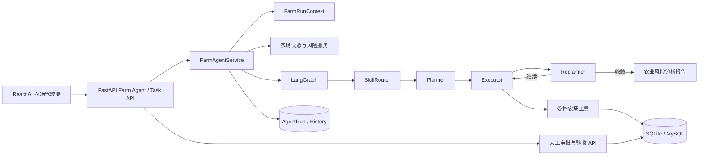

# AgroAgentOS 架构

## 产品闭环

AgroAgentOS 的比赛主线不是问答，而是可审计的农场行动闭环：

```text
AI 农场巡检
  → 结构化证据与风险
  → 待审批行动提案
  → 人工选择并批准动作
  → 农事任务执行与证据提交
  → AI 复核草稿
  → 人工完成或退回
```

智能体负责观察、分析、规划、调用工具、提出行动和复核证据；人类保留两道最终决策门：批准提案，以及完成或退回任务。

## 系统结构



图节点算法保持 `SkillRouter → Planner → Executor → Replanner`。巡检固定使用 `farm_inspection`，任务复核固定使用 `farm_task_verification`；普通农业问答仍以 `agriculture_qa` 兜底。

## 安全与权限

- 所有业务入口必须认证。
- `FarmRunContext` 用 `ContextVar` 绑定 `user_id`、`farm_id`、`run_id` 和运行类型。
- 工具参数不接受模型提供的用户 ID 或农场 ID，只读取可信运行上下文。
- 跨用户资源统一返回无权访问，不泄露资源是否存在。
- 智能体只能创建 `pending` 提案和保存复核草稿，不能自行批准提案、创建已批准任务或完成任务。
- 提案批准使用幂等与并发安全的状态转换；任务状态转换由服务层矩阵统一控制。

## 两个 Farm Skills

| Skill | 场景 | 允许的核心能力 |
|---|---|---|
| `farm_inspection` | 综合巡检 | 读取农场快照、读取天气、检查轨迹质量、搜索农业知识、创建待审批提案、读取提案 |
| `farm_task_verification` | 任务复核 | 读取任务证据、检查轨迹质量、搜索农业知识、保存 AI 复核草稿 |

复核 verdict 固定为 `pass | needs_evidence | rework | manual_review`。其中 AI 的 `pass` 仍只是建议，必须由人类调用完成接口。

## 七个受控工具

1. `get_farm_snapshot`
2. `inspect_farm_weather_risks`
3. `get_field_work_quality`
4. `get_pending_farm_tasks`
5. `get_task_evidence`
6. `create_action_proposal`
7. `save_task_verification_draft`

工具通过 `ToolMeta` 声明读写属性和风险级别。写工具只允许产生提案或复核草稿，不跨越人工决策门。

## 数据模型

| 模型 | 作用 |
|---|---|
| `FarmActionProposal` | 风险、证据、置信度和候选动作；初始状态固定为 pending |
| `FarmTask` | 人工批准后生成的执行任务、提交证据和复核草稿 |
| `AgentRun` | 运行上下文快照、transition、工具/Token/耗时统计和 outcome |
| `HistoryRecord` | 最终报告历史；新运行写 `source=farm_agent`，旧历史来源只读兼容 |

## API

### Farm Agent

| 方法 | 路径 | 说明 |
|---|---|---|
| POST | `/api/v1/farm-agent/inspections/stream` | 启动综合巡检并返回 SSE |
| GET | `/api/v1/farm-agent/runs/latest` | 读取当前用户最近一次真实巡检 |
| GET | `/api/v1/farm-agent/runs/{run_id}/timeline` | 读取真实运行时间线 |
| GET | `/api/v1/farm-agent/proposals` | 查询行动提案 |
| POST | `/api/v1/farm-agent/proposals/{id}/approve` | 人工批准所选动作 |
| POST | `/api/v1/farm-agent/proposals/{id}/reject` | 人工拒绝提案 |

### Farm Tasks

| 方法 | 路径 | 说明 |
|---|---|---|
| GET | `/api/v1/farm-tasks/` | 查询任务 |
| POST | `/api/v1/farm-tasks/{id}/start` | 开始执行 |
| POST | `/api/v1/farm-tasks/{id}/submit` | 提交文字、轨迹或附件证据 |
| POST | `/api/v1/farm-tasks/{id}/verify/stream` | 生成 AI 复核草稿 |
| POST | `/api/v1/farm-tasks/{id}/complete` | 人工完成 |
| POST | `/api/v1/farm-tasks/{id}/return` | 人工退回 |

## SSE 与可观测性

典型事件顺序为：

```text
start → context_loaded → skill_selected → plan
→ tool_call / step_complete / replan
→ proposal_created → report → complete
```

前端仅展示结构化事件、工具名称、状态、耗时和报告，不展示模型思维链。成功、失败、取消和客户端主动关闭都会关闭 stream sink 并持久化最终 `AgentRun` 状态。

## 比赛演示场景

`app/data/demo_rainstorm_scenario.json` 是版本化的 `rainstorm-v1` 演示输入，包含“比赛演示数据”标识、阳光农场、A1/A2/A3 地块、A1 水稻分蘖期、未来 24 小时 82mm 降雨和一条低质量轨迹。

```bash
python scripts/seed_competition_demo.py --username <已有用户名>
```

脚本只绑定已有用户，不创建账号或默认密码，重复执行保持幂等。演示天气默认关闭；只有请求显式传入 `demo_scenario=rainstorm` 且 `COMPETITION_DEMO_ENABLED=true` 时才读取 fixture。真实模式始终调用生产天气服务，演示数据也不会预写计划、报告、提案或 verdict。

## 主要目录

```text
app/agents/                 LangGraph 节点与运行状态
app/runtime/                FarmRunContext、工具运行与 transition
app/skills/definitions/     Farm Skills 与农业 Skills
app/tools/                  受控 Farm Agent 工具
app/services/               快照、风险、提案、任务与 Agent 服务
app/api/v1/                 Farm Agent、Farm Task 和其他业务路由
frontend-react/src/pages/   AI 农场驾驶舱与工作台
tests/integration/          比赛闭环和遗留运行时扫描
```

## 验证

```bash
alembic upgrade head
pytest tests -q
cd frontend-react
npm run build
```

全仓 lint 还会报告项目原有页面中的历史问题；Farm Agent 新增和修改文件需通过定向 ESLint 与 TypeScript 构建。
